# C Programming Repository

This repository contains C programming examples and practice programs to help build strong fundamentals in programming and problem-solving.

---

## 🗺️ C Language Learning Roadmap

```mermaid
flowchart TD

    A["💻 C Language"]

    A --> B["🔰 Basics"]
    B --> B1["Syntax"]
    B1 --> B2["Variables"]
    B2 --> B3["Input / Output"]
    B3 --> B4["Keywords & Identifiers"]

    B4 --> C["🔢 Data Types & Operators"]
    C --> C1["Data Types"]
    C1 --> C2["Arithmetic Operators"]
    C2 --> C3["Relational Operators"]
    C3 --> C4["Logical Operators"]
    C4 --> C5["Bitwise Operators"]

    C5 --> D["🔀 Control Flow"]
    D --> D1["if / else"]
    D1 --> D2["switch"]
    D2 --> D3["for Loop"]
    D3 --> D4["while Loop"]
    D4 --> D5["do-while"]
    D5 --> D6["break / continue"]

    D6 --> E["⚙️ Functions"]
    E --> E1["Function Declaration"]
    E1 --> E2["Parameters & Arguments"]
    E2 --> E3["Return Values"]
    E3 --> E4["Recursion"]

    E4 --> F["📦 Arrays & Strings"]
    F --> F1["1D Arrays"]
    F1 --> F2["2D Arrays"]
    F2 --> F3["Strings"]
    F3 --> F4["String Functions"]

    F4 --> G["👉 Pointers"]
    G --> G1["Pointer Basics"]
    G1 --> G2["& and *"]
    G2 --> G3["Pointers & Arrays"]
    G3 --> G4["Pointers & Functions"]
    G4 --> G5["Pointer to Pointer"]

    G5 --> H["🏗️ Structures & Unions"]
    H --> H1["Structure"]
    H1 --> H2["Nested Structure"]
    H2 --> H3["Union"]
    H3 --> H4["typedef"]

    H4 --> I["💾 File Handling"]
    I --> I1["File Open / Close"]
    I1 --> I2["Read / Write"]
    I2 --> I3["File Modes"]

    I3 --> J["🧠 Dynamic Memory"]
    J --> J1["malloc()"]
    J1 --> J2["calloc()"]
    J2 --> J3["realloc()"]
    J3 --> J4["free()"]
```


    
---

## 📚 Topics Covered

- Basic C Programs
- Variables and Data Types
- Operators
- Conditional Statements (if, else, switch)
- Loops (for, while, do-while)
- Functions
- Arrays
- Pointers
- Structures
- File Handling

---

## 🎯 Purpose

The main goal of this repository is to practice and improve C programming skills by implementing different concepts and solving problems.

---

## 🛠️ Tools Used

- C Language
- GCC Compiler
- Visual Studio Code

---

## 🚀 How to Run

1. Install a C compiler (GCC recommended).
2. Clone this repository.
```bash
git clone https://github.com/sumitkumar2374/C---Language.git

```
3. gcc program.c -o program # Navigate to the folder.
4. Run the program. # Compile the program.

5. ./program # Run the program.

---

## 👨‍💻 Author

**Sumit Kumar**  
B.Tech CSE Undergraduate | Aspiring Full Stack Web Developer

[GitHub](https://github.com/sumitkumar2374) 
